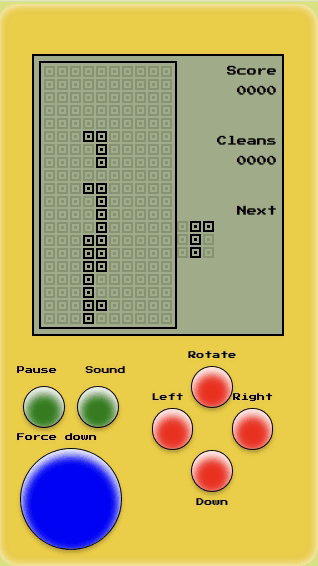
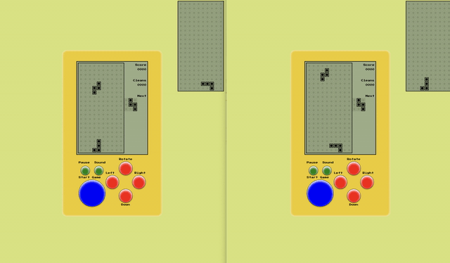

# Red tetris
The project is written totally in Javascript and especially in its es2015 (ES6)
version. Client code is written without a call to "this" in the purpose to use functional constructs and not object. 
The handling logic of the heap and pieces  implemented as "pure functions". The server code use object-oriented programming (prototype). Client application built from the React and Redux libraries. 
HTML code not use <TABLE /> elements, but be built exclusively from layout flexBox.

Not used:

1. A DOM manipulation library like jQuery
2. Canvas
3. SVG (Scalable Vector Graphics)

## Technology
1. React / Redux
2. Immutable
3. MongoDB
4. Mocha (tests)
5. NodeJS

## Install
1. Install MongoDB
2. npm install
3. npm run client-dev
4. npm run server-dev

### Mobile

### Multi play

